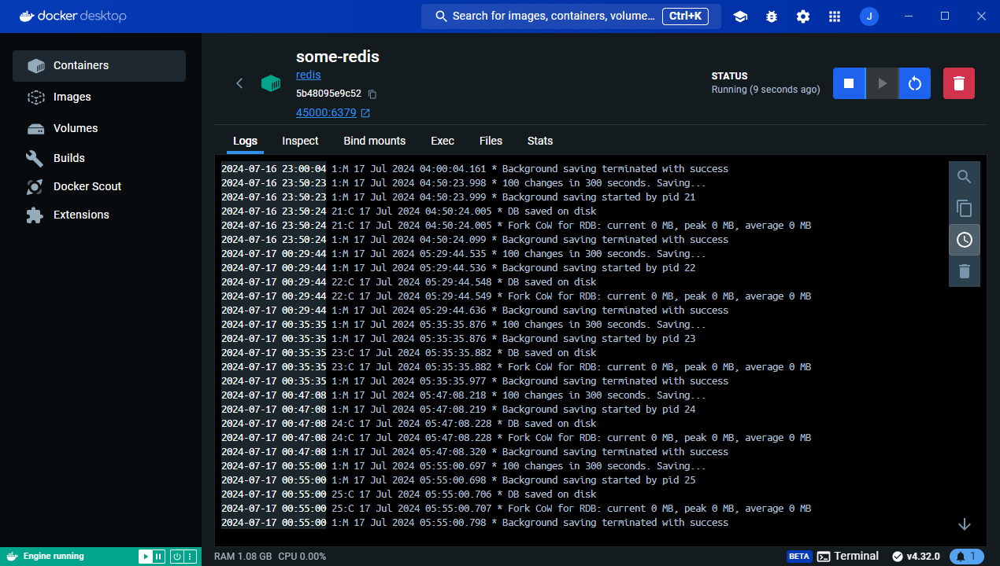
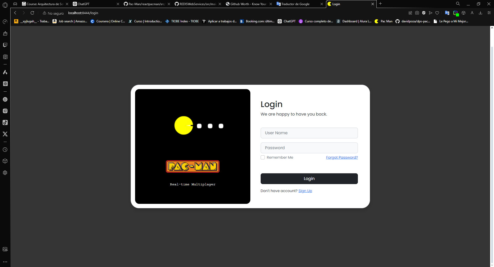

# PACMAN
### Installing

Clone the repository:
```bash
git clone https://github.com/JohannBulls/Pac-Man
```

### Running the Application

#### 1. Start Redis (via Docker)
```bash
docker run --name some-redis -p 45000:6379 -d redis
```

#### 2. Build and Run Spring Boot Application
```bash
cd Pac-Man
mvn spring-boot:run
```
Now open a browser and go to the following link to login: Login page



After logging in you access the board to start drawing Execution


You can also open a browser and go to the following link to access the project on AWS:


The application will be accessible at:
```
https://localhost:8444
```

### Usage

- Access the status endpoint to check server status:
  ```
  GET https://localhost:8444/status
  ```

- Generate a new ticket:
  ```
  GET https://localhost:8444/getticket
  ```

## Project Structure

### Backend (Spring Boot)


### Redis

- **TicketRepository.java**: Repository handling ticket generation and verification using Redis.

## Built With

- [Spring Boot](https://spring.io/projects/spring-boot) - Backend framework
- [Redis](https://redis.io/) - In-memory data store
- [Maven](https://maven.apache.org/) - Dependency management

## Authors

- Johann Amaya Lopez - [@JohannBulls](https://github.com/JohannBulls)

## License

This project is licensed under the GNU License - see the LICENSE.txt file for details.
