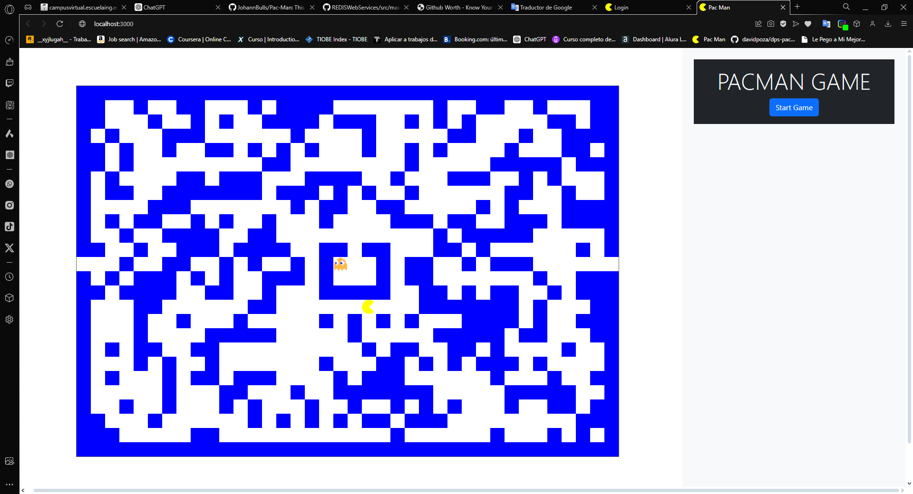
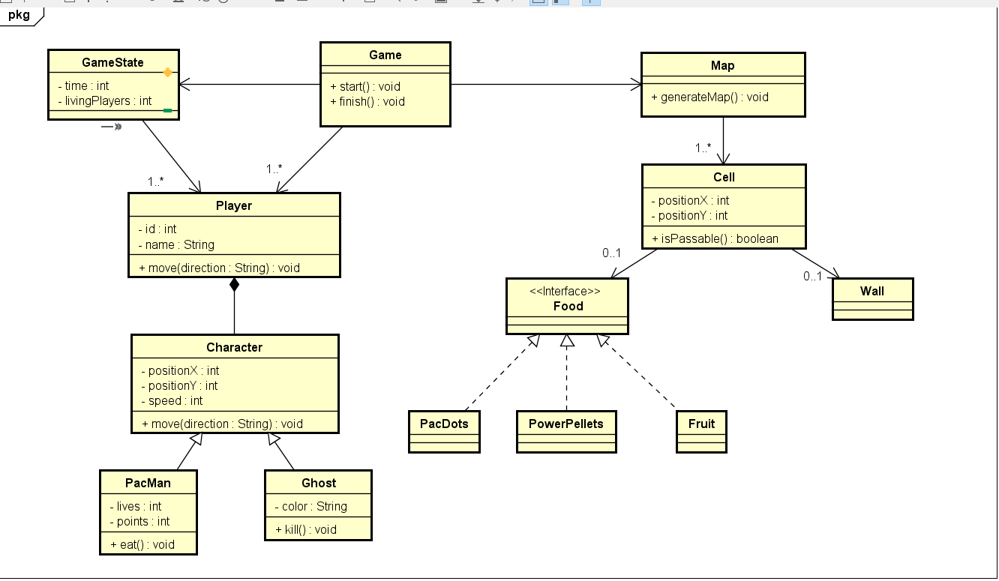

# Pacman Game

This project is a Pacman game developed with a Spring Boot backend and a React frontend. The backend provides APIs to generate the game board and handle Pacman's movements, while the frontend handles the game's user interface and interactions.

## Table of Contents

- [Installation](#installation)
- [Running the Backend](#running-the-backend)
- [Running the Frontend](#running-the-frontend)
- [Code Overview](#code-overview)
- [Usage](#usage)
- [License](#license)

## Installation

### Prerequisites

- Java 17 or later
- Maven
- Node.js and npm

### Backend Installation

1. **Clone the repository:**

    ```bash
    git clone https://github.com/JohannBulls/Pac-Man.git
    cd Pac-Man
    ```

2. **Navigate to the backend directory:**

    ```bash
    cd springpacman
    ```

3. **Build the project using Maven:**

    ```bash
    mvn clean install
    ```

4. **Run the Spring Boot application:**

    ```bash
    mvn spring-boot:run
    ```

    The backend server will start and listen on port `8080` by default.

### Frontend Installation

1. **Navigate to the React directory:**

    ```bash
    cd ../reactpacman
    ```

2. **Install the required npm packages:**

    ```bash
    npm install
    ```

3. **Start the React application:**

    ```bash
    npm start
    ```

    The React application will start and should be accessible at `http://localhost:3000`.

## Code Overview

### Backend

- **`MoveRequest` Class:** Handles requests related to Pacman's movements, including the direction of movement.
- **`PacmanController` Class:** Provides endpoints to start the game and to handle Pacman's movements. It processes the direction and returns responses indicating the result of the movement or any errors.
- **`SpringpacmanApplication` Class:** The entry point of the Spring Boot application, responsible for starting the application.
- **`WebConfig` Class:** Configures CORS (Cross-Origin Resource Sharing) to allow requests from the React frontend running on a different port.

### Frontend

- **`App` Component:** Manages the game state, including the board, Pacman, and ghost positions. It handles user input, communicates with the backend API to move Pacman, and manages game music.
- **`Board` Component:** Renders the game board on a canvas, displaying Pacman and the ghost using images. It updates the canvas whenever the board or the positions of Pacman and the ghost change.

## Usage

1. **Start the Backend:**

    Make sure the Spring Boot application is running. It should be accessible at `http://localhost:8080`.

2. **Start the Frontend:**

    Ensure the React application is running. It should be accessible at `http://localhost:3000`.

3. **Interacting with the Game:**

    - Use the arrow keys (`w`, `a`, `s`, `d`) to move Pacman around the board.
    - The game will alert you if Pacman is caught by the ghost.



### Class Diagram



### Architectural Design

.png)

## License

This project is licensed under the MIT License - see the [LICENSE](LICENSE) file for details.
